<div align="center">

<!-- Logo/Banner Section -->


<br/>

<!-- Animated Title -->
<h1>
  
</h1>

<!-- Badges Row -->
<p>
  
  
  
  
</p>

<!-- Quick Links -->
<p>
  <a href="#-features">
    
  </a>
  <a href="#-quick-start">
    
  </a>
  <a href="#-deployment">
    
  </a>
  <a href="#-license">
    
  </a>
</p>

<!-- Social Stats -->
<p>
  
  
  
  
</p>

<!-- Description -->
<h3>
  
  A Modern, Responsive & Feature-Rich Portfolio
  
</h3>

<p align="center">
  <i>Showcasing skills, projects, and achievements with an elegant and performant web experience</i>
</p>

<br/>

<!-- Demo Buttons -->
<a href="https://your-portfolio-url.com">
  
</a>
<a href="https://github.com/riteshpatel1884/portfolio/issues">
  
</a>
<a href="https://github.com/riteshpatel1884/portfolio/issues">
  
</a>

<br/><br/>

</div>

---

<div align="center">

## ✨ **Features**

</div>

<table>
<tr>
<td width="50%">

### 🎨 **Modern & Elegant Design**
```yaml
Design Philosophy:
  - Minimalist aesthetics
  - Emerald green accents
  - Smooth micro-interactions
  - Professional typography
```

</td>
<td width="50%">

### 🌓 **Theme Switching**
```yaml
Dark Mode Features:
  - One-click toggle
  - Smooth transitions
  - Persistent preferences
  - Eye-friendly colors
```

</td>
</tr>
<tr>
<td width="50%">

### 📱 **Fully Responsive**
```yaml
Device Support:
  - Mobile-first design
  - Tablet optimized
  - Desktop enhanced
  - Touch-friendly UI
```

</td>
<td width="50%">

### ⚡ **Performance Optimized**
```yaml
Speed Metrics:
  - Vite bundler
  - Code splitting
  - Lazy loading
  - <100ms load time
```

</td>
</tr>
</table>

<div align="center">

### 🎯 **What Makes This Portfolio Special?**

| Feature | Description | Impact |
|:-------:|:-----------:|:------:|
| 🎭 | **Interactive Animations** | Engaging user experience |
| 🎨 | **Custom Styling** | Unique brand identity |
| 📊 | **Project Showcases** | Professional presentation |
| 🛠️ | **Skills Matrix** | Clear competency display |
| 📜 | **Certifications** | Credibility boost |
| 💌 | **Easy Contact** | Seamless networking |

</div>

---

<div align="center">

## 🛠️ **Tech Stack**

</div>

<div align="center">

<table>
<tr>
<td align="center" width="25%">
<br/>
<sub><b>React 18</b></sub><br/>
<sub>UI Library</sub>
</td>
<td align="center" width="25%">
<br/>
<sub><b>Tailwind CSS</b></sub><br/>
<sub>Styling</sub>
</td>
<td align="center" width="25%">
<br/>
<sub><b>Vite 5</b></sub><br/>
<sub>Build Tool</sub>
</td>
<td align="center" width="25%">
<br/>
<sub><b>JavaScript</b></sub><br/>
<sub>Language</sub>
</td>
</tr>
</table>

### **Additional Technologies**

 
 
 


</div>

---

<div align="center">

## 🚀 **Quick Start**

</div>

### **Prerequisites**

<table>
<tr>
<td>

```bash
# Node.js version
node --version
# v18.0.0 or higher
```

</td>
<td>

```bash
# npm version
npm --version  
# 9.0.0 or higher
```

</td>
</tr>
</table>

### **Installation Steps**

```mermaid
graph LR
    A[📥 Clone] --> B[📦 Install]
    B --> C[🎨 Customize]
    C --> D[🚀 Run]
    D --> E[🌐 Deploy]
    style A fill:#10B981
    style B fill:#3B82F6
    style C fill:#F59E0B
    style D fill:#8B5CF6
    style E fill:#EC4899
```

<div align="center">



</div>

#### **Step 1️⃣ : Clone the Repository**

```bash
git clone https://github.com/riteshpatel1884/portfolio.git
cd portfolio
```

#### **Step 2️⃣ : Install Dependencies**

```bash
npm install
```

<details>
<summary><b>Using Yarn?</b></summary>

```bash
yarn install
```

</details>

#### **Step 3️⃣ : Start Development Server**

```bash
npm run dev
```

<div align="center">

**🎉 Your portfolio is now running at [`http://localhost:5173`](http://localhost:5173)**

</div>

#### **Step 4️⃣ : Build for Production**

```bash
npm run build
```

#### **Step 5️⃣ : Preview Production Build**

```bash
npm run preview
```

---

<div align="center">

## 🌐 **Deployment**

<p><i>Deploy your portfolio to the cloud in minutes</i></p>

</div>

<table>
<tr>
<td align="center" width="33%">

###  **Vercel**

[](https://vercel.com/new/clone?repository-url=https://github.com/riteshpatel1884/portfolio)

```bash
npm i -g vercel
vercel
```

**⚡ Auto Deploy on Push**

</td>
<td align="center" width="33%">

###  **Netlify**

[](https://app.netlify.com/start)

```bash
npm i -g netlify-cli
netlify deploy --prod
```

**🔄 Continuous Deployment**

</td>
<td align="center" width="33%">

###  **GitHub Pages**

```bash
npm i -D gh-pages
npm run deploy
```

**📦 Free Hosting**

</td>
</tr>
</table>

<details>
<summary><b>📘 Detailed Deployment Guide</b></summary>

### **For Vercel:**
1. Push your code to GitHub
2. Import project in [Vercel Dashboard](https://vercel.com/new)
3. Click "Deploy" - Done! ✅

### **For Netlify:**
1. Push your code to GitHub
2. Go to [Netlify](https://app.netlify.com/start)
3. Connect repository and deploy

### **For GitHub Pages:**
1. Add to `package.json`:
```json
{
  "homepage": "https://riteshpatel1884.github.io/portfolio",
  "scripts": {
    "predeploy": "npm run build",
    "deploy": "gh-pages -d dist"
  }
}
```
2. Run: `npm run deploy`

</details>

---

<div align="center">

## 📂 **Project Structure**

</div>

```
portfolio/
│
├── 📁 public/                    # Static assets
│   └── vite.svg
│
├── 📁 src/
│   ├── 📁 components/            # Reusable components
│   │   └── Portfolio.jsx         # Main portfolio component
│   │
│   ├── 📄 App.jsx                # Root component
│   ├── 📄 main.jsx               # Entry point
│   └── 📄 index.css              # Global styles
│
├── 📄 index.html                 # HTML template
├── 📄 package.json               # Project dependencies
├── 📄 vite.config.js             # Vite configuration
├── 📄 tailwind.config.js         # Tailwind configuration
├── 📄 postcss.config.js          # PostCSS configuration
├── 📄 .gitignore                 # Git ignore rules
├── 📄 README.md                  # This file
└── 📄 LICENSE                    # MIT License
```

---

<div align="center">

## 🎨 **Customization Guide**

</div>

### **1. Update Personal Information**

Edit `src/components/Portfolio.jsx`:

```javascript
// Personal Details
const personalInfo = {
  name: "Your Name",
  title: "Your Title",
  email: "your.email@example.com",
  phone: "+1234567890",
  github: "yourusername",
  linkedin: "yourusername"
};
```

### **2. Modify Color Scheme**

```javascript
// Theme Colors
const theme = {
  accent: darkMode ? 'text-emerald-400' : 'text-emerald-600',
  accentBg: darkMode ? 'bg-emerald-400/10' : 'bg-emerald-600/10',
  // Change 'emerald' to: blue, purple, pink, orange, etc.
};
```

<details>
<summary><b>🎨 Available Color Options</b></summary>

- `emerald` (default)
- `blue`
- `purple`
- `pink`
- `orange`
- `red`
- `teal`
- `cyan`
- `indigo`

</details>

### **3. Add New Projects**

```javascript
const projects = [
  {
    title: "Project Name",
    description: "Project description",
    tech: ["React", "Node.js", "MongoDB"],
    status: "Completed", // or "In Progress"
    link: "https://project-url.com"
  }
];
```

### **4. Update Skills**

```javascript
const skills = {
  'Category Name': ['Skill 1', 'Skill 2', 'Skill 3'],
  // Add more categories
};
```

---

<div align="center">

## 📸 **Screenshots**

</div>

<table>
<tr>
<td width="50%">

### 🖥️ Desktop View (Dark Mode)


</td>
<td width="50%">

### 🖥️ Desktop View (Light Mode)


</td>
</tr>
<tr>
<td width="50%">

### 📱 Mobile View


</td>
<td width="50%">

### 🔄 Theme Toggle


</td>
</tr>
</table>

---

<div align="center">

## 🤝 **Contributing**

<p><i>Contributions make the open-source community an amazing place to learn and create!</i></p>

</div>

### **How to Contribute?**

1. **Fork** the Project
2. **Create** your Feature Branch
   ```bash
   git checkout -b feature/AmazingFeature
   ```
3. **Commit** your Changes
   ```bash
   git commit -m 'Add some AmazingFeature'
   ```
4. **Push** to the Branch
   ```bash
   git push origin feature/AmazingFeature
   ```
5. **Open** a Pull Request

<div align="center">

**All contributions are welcome! 🎉**


</div>

---

<div align="center">

## 📊 **GitHub Stats**


</div>

---

<div align="center">

## 📄 **License**

<p>This project is licensed under the <b>MIT License</b></p>


<details>
<summary><b>View License Details</b></summary>

```
MIT License

Copyright (c) 2024 Ritesh Patel

Permission is hereby granted, free of charge, to any person obtaining a copy
of this software and associated documentation files (the "Software"), to deal
in the Software without restriction, including without limitation the rights
to use, copy, modify, merge, publish, distribute, sublicense, and/or sell
copies of the Software, and to permit persons to whom the Software is
furnished to do so, subject to the following conditions:

The above copyright notice and this permission notice shall be included in all
copies or substantial portions of the Software.

THE SOFTWARE IS PROVIDED "AS IS", WITHOUT WARRANTY OF ANY KIND, EXPRESS OR
IMPLIED, INCLUDING BUT NOT LIMITED TO THE WARRANTIES OF MERCHANTABILITY,
FITNESS FOR A PARTICULAR PURPOSE AND NONINFRINGEMENT.
```

</details>

</div>

---

<div align="center">

## 👨‍💻 **About Me**


</div>

<table align="center">
<tr>
<td align="center" width="33%">

### 🎓 **Education**
B.Tech in Computer Science  
KIET Group of Institutions  
**GPA:** 7.39/10

</td>
<td align="center" width="33%">

### 💼 **Specialization**
Machine Learning  
Full-Stack Development  
Image Processing

</td>
<td align="center" width="33%">

### 🏆 **Certifications**
Oracle Cloud Infrastructure  
Generative AI Professional  
**2025**

</td>
</tr>
</table>

<div align="center">

### **Let's Connect!**

<a href="https://github.com/riteshpatel1884">
  
</a>
<a href="https://linkedin.com/in/riteshpatel1884">
  
</a>
<a href="mailto:riteshpatel1884@gmail.com">
  
</a>
<a href="tel:+918858295418">
  
</a>

</div>

---

<div align="center">

## 🙏 **Acknowledgments**

</div>

<table>
<tr>
<td align="center" width="25%">
<br/>
<b>React Team</b><br/>
<sub>For the amazing library</sub>
</td>
<td align="center" width="25%">
<br/>
<b>Tailwind Labs</b><br/>
<sub>For utility-first CSS</sub>
</td>
<td align="center" width="25%">
<br/>
<b>Vite Team</b><br/>
<sub>For blazing fast builds</sub>
</td>
<td align="center" width="25%">
<br/>
<b>Lucide</b><br/>
<sub>For beautiful icons</sub>
</td>
</tr>
</table>

---

<div align="center">

## 🗺️ **Roadmap**

</div>


### **Upcoming Features**

- [ ] 📝 Blog section with Markdown support
- [ ] 🎞️ Project demos and videos
- [ ] 🌍 Multi-language support (i18n)
- [ ] 📊 Analytics dashboard integration
- [ ] 🎨 More theme options
- [ ] 💬 Contact form with email integration
- [ ] 🔍 Advanced SEO optimization
- [ ] ♿ Enhanced accessibility (WCAG 2.1)
- [ ] 🤖 AI chatbot for visitor interaction
- [ ] 📱 Progressive Web App (PWA)

---

<div align="center">

## 💬 **Support**

<p><i>If you like this project, please consider giving it a ⭐</i></p>

<a href="https://github.com/riteshpatel1884/portfolio/stargazers">
  
</a>
<a href="https://github.com/riteshpatel1884/portfolio/network/members">
  
</a>

<br/><br/>

**Have questions or suggestions?**

<a href="https://github.com/riteshpatel1884/portfolio/issues/new">
  
</a>
<a href="https://github.com/riteshpatel1884/portfolio/discussions">
  
</a>

</div>

---

<div align="center">


### **Made with 💚 and ☕ by Ritesh Patel**

<p>
  <i>"Code is like humor. When you have to explain it, it's bad." – Cory House</i>
</p>

**© 2024 Ritesh Patel. All rights reserved.**


</div>
